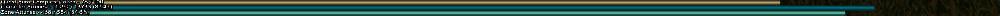
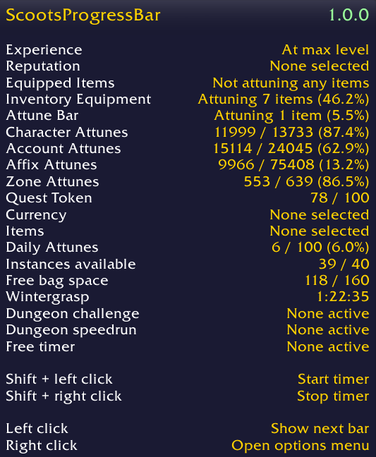
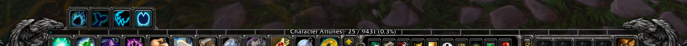
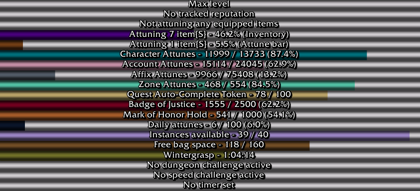

## Description ##

This is a highly-customisable replacement for the limited experience/reputation bars and the addons that otherwise exist to replace them. Features a number of trackable statistics:
* Experience.
* Tracked reputation.
* Equipped item attunement.
* Inventory item attunement (prestige).
* Attune Bar item attunement.
* Character attunes.
* Account attunes.
* Affix attunes.
* Current-zone attunes.
* Next Quest Auto-Complete Token.
* Currency (you can select a currency and a target number).
* Item (You can select an item and a target number).
* Daily attunes (you can specify scope and a target number).
* Instances available.
* Free bag space.
* Next Wintergrasp.
* Current dungeon challenge.
* Current dungeon speedrun.
* Free timer (you define timer duration and can [re-]start with a click).

Other noteworthy features:
* Two modes - switch between viewing a single bar at a time (left-click to cycle between them) or all enabled bars.
* Very large number of customisation options.
* Ability to seamlessly blend with default Blizzard interface.
* Options profiles for per-character behaviour/visuals.

## Installation ##

Download this repository, then extract the `ScootsProgressBar` subdirectory from the `src` directory into your `World of Warcraft/Interface/AddOns` directory.

## Screenshots ##

## Support ##

If you'd like to show support for my addons you can use the button below.

Please do not feel obligated to do so - especially if you are not in a financially secure position - and please don't give beyond your means.

